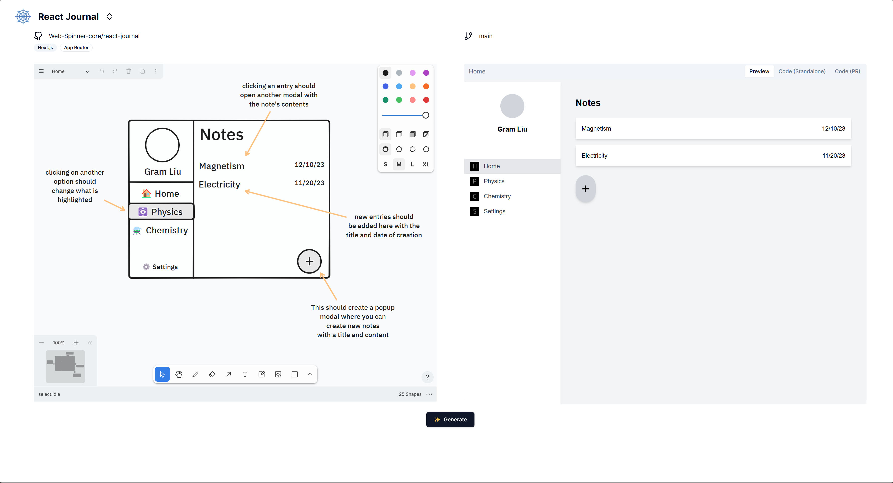
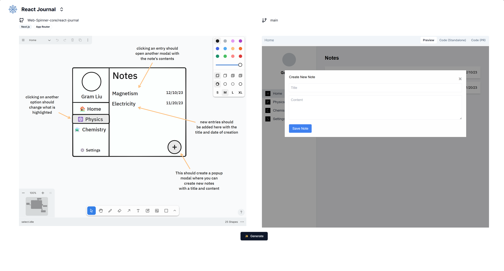
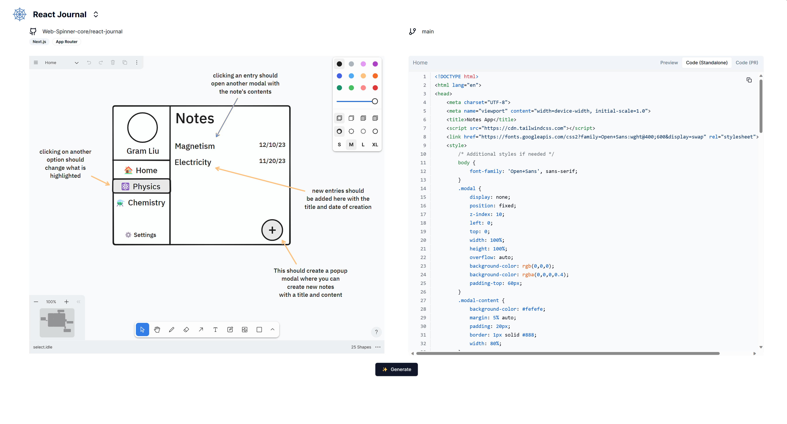
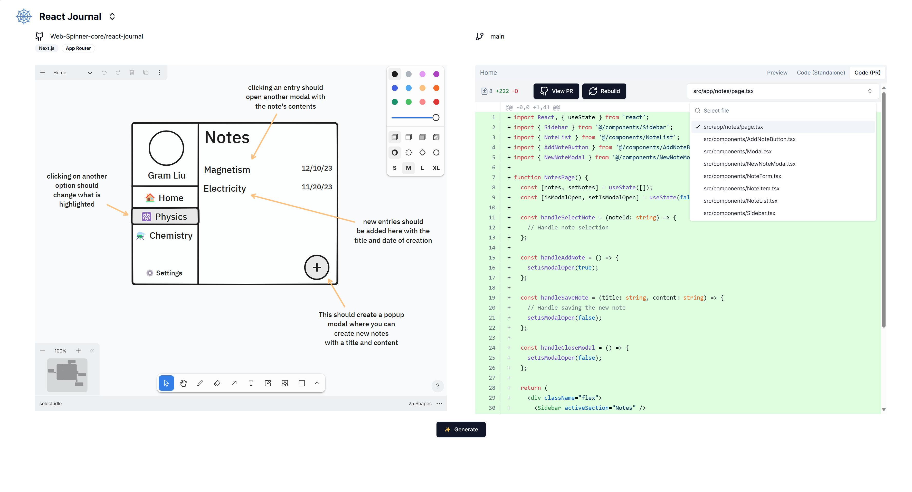
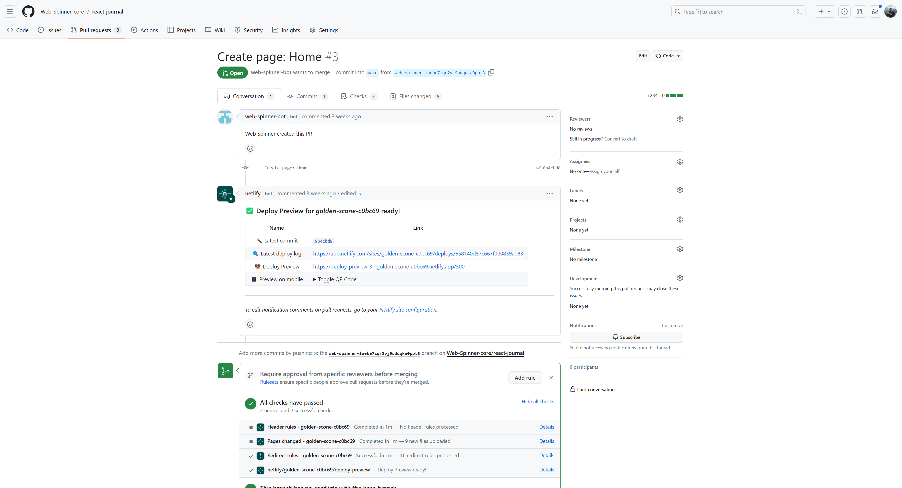

# Web Spinner

Web Spinner is a tool that creates modular React code from low-fidelity mockups.

See it in action: [Twitter](https://x.com/gramliu/status/1737273439608775088?s=20)

## Getting Started
```
pnpm run apps
```

## Screenshots
### Generate an interactive preview of your design in action




### View the draft code for the preview


### Generate a PR on your codebase with the modular code changes


